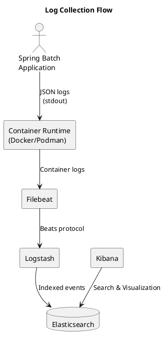

# Обоснование выбора способа отправки логов и конфигурации оповещений

## Выбор способа отправки логов

### Требования

Система должна обеспечивать:

* централизованный сбор логов;
* поиск ошибок выполнения Spring Batch Job;
* возможность анализа причин отказов ETL-процессов;
* масштабирование при переходе к микросервисной архитектуре.

### Рассмотренные варианты

#### Прямое логирование в Elasticsearch

Преимущества:

* простая архитектура;
* отсутствие промежуточных компонентов.

Недостатки:

* высокая связанность приложения и системы логирования;
* дополнительные зависимости в приложении;
* сложность изменения логирующей инфраструктуры.

#### Filebeat + Logstash + Elasticsearch

Преимущества:

* слабая связанность приложения и платформы логирования;
* возможность фильтрации и преобразования логов;
* поддержка масштабирования;
* соответствие типовой архитектуре ELK.

Недостатки:

* дополнительные компоненты инфраструктуры.

### Принятое решение

Выбран ELK Stack:

* Filebeat;
* Logstash;
* Elasticsearch;
* Kibana.

Spring Batch приложение формирует структурированные JSON-логи через Logback.

Filebeat собирает контейнерные логи и передаёт их в Logstash.

Logstash выполняет обработку и отправляет события в Elasticsearch.

Kibana используется для поиска и анализа логов.

### Схема передачи логов

## Выбор конфигурации оповещений

### Требования

Необходимо оперативно выявлять:

* недоступность приложения;
* деградацию производительности;
* ошибки пакетной обработки данных.

### Рассмотренные варианты

#### Alertmanager

Преимущества:

* гибкая маршрутизация уведомлений;
* поддержка различных каналов доставки.

Недостатки:

* дополнительный компонент инфраструктуры.

#### Grafana Alerting

Преимущества:

* интеграция с существующими дашбордами;
* простая настройка;
* единый интерфейс мониторинга.

Недостатки:

* меньшая гибкость по сравнению с Alertmanager.

### Принятое решение

Для проекта используется Grafana Alerting.

### Настроенные оповещения

#### ApplicationDown

Назначение:

Контроль доступности Spring Batch приложения.

Условие:

up == 0

Порог:

1 минута.

Причина выбора:

Позволяет быстро обнаружить остановку приложения или потерю сетевой доступности.

#### HighJvmMemoryUsage

Назначение:

Контроль использования памяти JVM.

Условие:

Использование heap-памяти более 80%.

Причина выбора:

Предотвращение деградации производительности и возможных ошибок OutOfMemoryError.

## Итог

Выбранная конфигурация обеспечивает:

* централизованный сбор логов;
* визуализацию логов и метрик;
* оперативное выявление отказов;
* готовность к дальнейшей миграции на микросервисную архитектуру.
